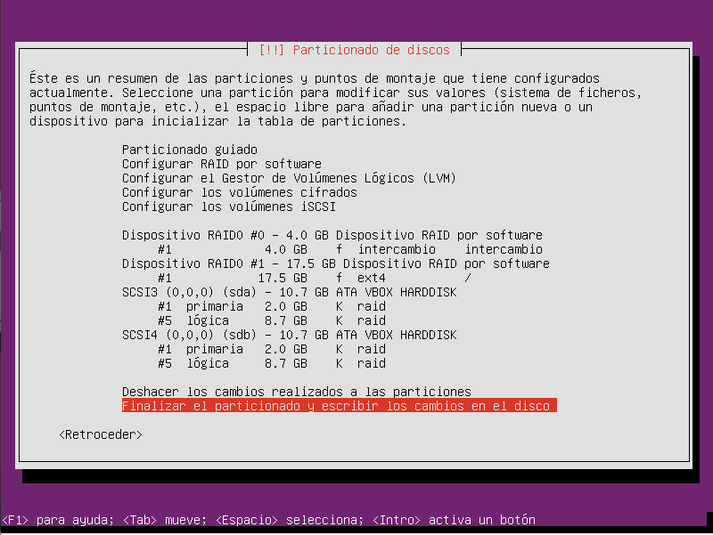
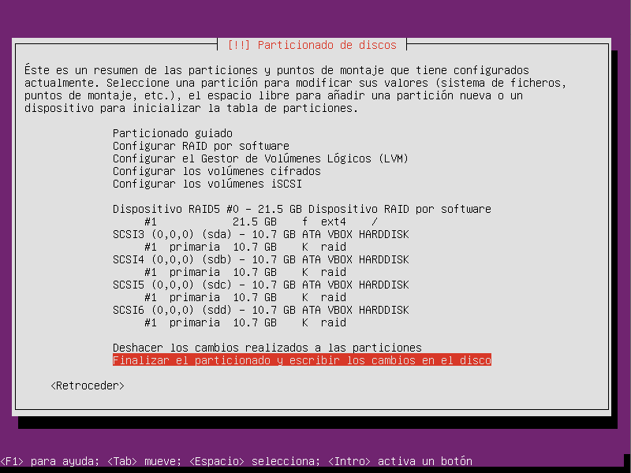

# DNS / RAID / FTP

## INSTALACIÓN DNS:

1.
~~~
apt-get install bind9
~~~

### Editamos los archivos de configuración (/etc/bind/):

#### named.conf.local
~~~
zone "sitioa.com" {
        type master;
    file "/etc/bind/rd.sitioa.com"";
};

<-------------------------------------->

zone "sitiob.net"{
        type master;
    file "/etc/bind/rd.sitiob.net";
};

<-------------------------------------->

zone "sitioc.net" {
        type master;
    file "/etc/bind/rd.sitioc.net";
};

<-------------------------------------->

// Resolución inversa

zone "5.168.192.in-addr.arpa" {
    type master;
        file "/etc/bind/r1.192.168.5";
};

<-------------------------------------->
~~~

#### rd.dam1.com
~~~									
$TTL 38400

@   IN  SOA servidor01.sitioa.com. correoadmin.sitioa.com. (
            2014092901
            28800
            3600
            604800
            38400 )

@ IN NS servidor01.sitioa.com.
servidor01.sitioa.com. IN A 192.168.5.20
www.sitioa.com. IN CNAME servidor01.sitioa.com.

<------------------------------------------------------------->

$TTL 38400

@   IN  SOA servidor01.sitiob.net. correoadmin.sitiob.net. (
            2014092901
            28800
            3600
            604800
            38400 )

@ IN NS servidor01.sitiob.net.
servidor02.sitiob.net. IN A 192.168.5.21
www.sitiob.net. IN CNAME servidor01.sitiob.net.

<------------------------------------------------------------->

$TTL 38400

@   IN  SOA servidor01.sitioc.net. correoadmin.sitioc.net. (
            2014092901
            28800
            3600
            604800
            38400 )

@ IN NS servidor01.sitioc.net.
servidor03.sitioc.net. IN A 192.168.5.22
www.sitioc.net. IN CNAME servidor01.sitioc.net. 

<------------------------------------------------------------->
~~~

#### ri.192.168.5
~~~
$TTL 38400

@   IN  SOA servidor01.sitioa.com. correoadmin.sitioa.com. (
    2014092900;  //num serie
    28800; //refresco
    3600;  //reintentos
    604800; //caducidad
        38400); // tiempo en caché

@ IN NS servidor01.
20 IN PTR servidor01.
@ IN NS servidor02.
21 IN PTR servidor02.
@ IN NS servidor03.
22 IN PTR servidor03.
~~~

### CONFIGURACIÓN ROUTER:  
  
1. 
~~~  
nano /etc/sysctl.conf  
~~~

2.
~~~   
net.ipv4.ip_forward=1  
~~~

3.  
~~~  
nano router.sh
~~~

4.  
~~~  
#!/bin/bash  
iptables -t nat -A POSTROUTING -o ens33 -j MASQUERADE  
~~~  

5.
~~~   
sh /home/usuario/router.sh  
~~~

## EJERCICIO RAID:

### Raid0: 

### Raid5:

## INSTALACIÓN FTP:

1.
~~~
apt-get install vsftpd
~~~

2.
~~~
cat /etc/vsftpd.conf
~~~

3.
~~~
cat /etc/vsftpd.conf | grep -v “^#”
~~~

4.
~~~
cat /etc/vsftpd.conf
~~~

Resultado.
~~~
listen=YES
anonymous_enable=NO
local_enable=YES
dirmessage_enable=YES
use_localtime=YES
xferlog_enable=YES
connect_from_port_20=YES
secure_chroot_dir=/var/run/vsftpd/empty
pam_service_name=vsftpd
rsa_cert_file=/etc/ssl/private/vsftpd.pem
~~~

5. AÑADIR UN USUARIO
~~~
useradd -d /home/usuario -m -s /bin/bash usuario
~~~

6.
~~~
passwd usuario
~~~
